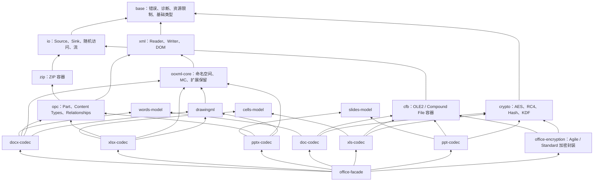

# Background

> grill-me，rdocx的迁移目前正在进行，本项目未来需要引入重写Aspose的cells和slides，我需要一个确切的项目架构设计进行统一office，分析项目当前的架构设计/模块划分是否合适，现在正处在初级阶段，架构重构即使项目方向调整还是比较容易的，如果到后期那么维护可能比较难，所以需要进行调整一个架构设计吗以适应三个项目的设计

<details><summary>3 previous messages</summary>

> 我会使用 `grill-me` 技能，把这次讨论当成一次架构决策审讯：先从现有代码和模块边界拿到证据，再逐个逼近“统一 Office”真正需要统一的层次、可接受的兼容成本和未来三个引擎的边界。这个技能会让我们先形成共同理解，而不是现在就贸然重构。
>
> 我先自己回答所有能从仓库里回答的问题：目录结构、公共抽象、`rdocx` 的迁移落点、构建目标和依赖方向。只有那些属于产品边界或长期承诺、代码里没有答案的问题，我才会一次问你一个。
>
> 初步证据已经很明确：源码目录看起来分成 `common/document/presentation/spreadsheet`，但构建层目前仍把全部 `.cpp` 聚合成单一 `xmole2` target；也就是说“文件夹模块化”已经有了，“可独立依赖、可独立发布、受构建系统约束的模块边界”还没有。接下来我会检查公共层是否真的只含跨格式概念，以及三个 Facade 是否已经泄漏 OPC/OOXML 细节。
> </details>

初步结论：需要现在调整架构。

当前主要问题不是目录命名，而是：

- 所有源码仍编译成单一 `xmole2` target，模块边界无法被构建系统验证。
- `common/oxml/shared.hpp` 已混入大量 Word 专属类型，未来 Cells/Slides 会污染公共层。
- 三个入口命名空间不一致：`oxml::document`、`presentation::oxml`、`spreadsheet::oxml`。
- Package Facade 直接公开 `OpcPackage` 和原始 XML，存储层、格式模型与用户 API 尚未隔离。
- 当前更像“扩大的 rdocx”，还不是能够承载 Words、Cells、Slides 三套产品的统一架构。

我的方向性建议是：只统一基础设施、OPC、DrawingML、错误模型和工程规范；不要建立一个强行覆盖 Word/Excel/PowerPoint 的统一文档对象模型。三种格式的领域模型必须独立。

# 1QA

第一个关键问题：

你所说的“重写 Aspose.Cells 和 Aspose.Slides”，是否要求已有 Aspose 用户代码能够基本不改、重新编译后直接使用，即要求公开 API 的源码兼容？

我的推荐答案是：核心引擎不追求 Aspose API 兼容；如果确实需要兼容，则在独立的 compatibility facade 中实现 Aspose 风格 API。这个选择将直接决定类型系统、命名空间、对象生命周期和模块边界。

> 核心引擎不追求 Aspose API 兼容

很好，这意味着可以避免被 Aspose 的历史 API 和对象模型绑架。

# 2QA

第二个关键问题：

“统一 Office”是否要求用户通过同一个顶层对象（例如 `OfficeDocument`）操作 DOCX、XLSX、PPTX 的内容，还是只要求三者共享工程体系、基础设施和一致的 API 设计规范？

我的推荐答案是：统一打开、保存、格式检测、诊断等文档生命周期操作，但不统一内容对象模型。也就是可以有统一的 `OfficePackage`/格式检测入口，但内容操作分别进入 `WordDocument`、`Workbook` 和 `Presentation`。段落、单元格、幻灯片不存在足够稳定的共同语义，强行抽象最终通常会变成大量可选字段、类型判断和能力缺口。

> 统一打开、保存、格式检测、诊断等文档生命周期操作，但不统一内容对象模型。也就是可以有统一的 OfficePackage/格式检测入口，但内容操作分别进入 WordDocument、Workbook 和 Presentation。

# 3QA

第三个关键问题：

打开现有 Office 文件、只修改一个局部内容再保存时，是否要求尽可能保留库尚未理解的 XML、扩展节点、关系和嵌入对象？

我的推荐答案是：把高保真往返作为硬性架构要求，但允许按功能建立明确的保真等级。核心模型应采用“语义对象 + 未识别内容保留”的混合方式，不能把文件完全解析成简化对象后重新生成，否则 Cells 和 Slides 引入后会持续丢失厂商扩展、图表、嵌入对象及暂未实现的属性。

> 把高保真往返作为硬性架构要求，但允许按功能建立明确的保真等级。核心模型应采用“语义对象 + 未识别内容保留”的混合方式，不能把文件完全解析成简化对象后重新生成，否则 Cells 和 Slides 引入后会持续丢失厂商扩展、图表、嵌入对象及暂未实现的属性

# 4QA

第四个关键问题：

是否要把“大型 XLSX 的受控内存占用”设为核心架构约束，例如不能因为打开一个数百 MB 的工作簿就把全部 ZIP Part 和所有工作表 DOM 同时驻留内存？

我的推荐答案是：要。当前 `OpcPackage` 会把所有 Part 完整读入 `flat_hash_map<string, vector<uint8_t>>`，这对 DOCX 尚可，但会成为 Cells 的结构性瓶颈。

建议未来采用：

- OPC 层只建立 Part 索引，按需读取。
- 未修改 Part 保存时直接复制。
- XML Part 按需解析并记录 dirty 状态。
- 工作表支持行级流式读取，并将“完整随机编辑模型”作为显式的高内存模式。
- DOCX/PPTX 可以默认按 Part 懒加载，不必一开始就做细粒度流式解析。

> 要。当前 OpcPackage 会把所有 Part 完整读入 flat_hash_map<string, vector<uint8_t>>，这对 DOCX 尚可，但会成为 Cells 的结构性瓶颈。
> 建议未来采用：
> OPC 层只建立 Part 索引，按需读取。
> 未修改 Part 保存时直接复制。
> XML Part 按需解析并记录 dirty 状态。
> 工作表支持行级流式读取，并将“完整随机编辑模型”作为显式的高内存模式。
> DOCX/PPTX 可以默认按 Part 懒加载，不必一开始就做细粒度流式解析。

# 5QA

第五个关键问题：

是否接受把项目拆成多个真正独立的 CMake library target，而不是继续由一个 `xmole2` target 编译全部源码，即使最终仍提供一个统一安装包和总入口头文件？

我的推荐答案是：接受，而且应当尽早执行。建议至少形成以下依赖方向：

`base → xml → opc → drawingml → {words, cells, slides} → office facade`

其中 `words`、`cells`、`slides` 彼此不得依赖；`office facade` 只负责格式检测和分派。这样依赖边界可以由链接关系验证，用户也能只链接所需模块，而统一安装体验仍可保留。

> 继续第五个问题探讨，加密解密处在那一层、另外项目不仅仅是除了OXML还需要处理OLE2，整体base → xml → opc → drawingml → {words, cells, slides} → office facade全面链路的应该是？

这条链路不应是线性的。`OPC` 与 `OLE2` 不是上下级关系，而是两条并行的容器路径；加密也需要拆成“密码学基础能力”和“Office 加密协议”两层。



加密层的确切位置：

- `crypto` 是底层算法库，不知道 DOCX、XLSX、PPTX、OPC 或 OLE2。
- `office-encryption` 实现 ECMA-376 Agile/Standard Encryption。加密的 OOXML 文件外层实际上是 CFB/OLE2，解密后才得到 OPC 包。
- `OPC` 不应依赖加密模块，也不应负责密码验证。
- 旧版 DOC/XLS/PPT 的加密细节属于对应的二进制 codec；它们可以复用 `crypto`，但不应硬塞进 OPC 加密协议模块。
- `office-facade` 负责识别输入并编排正确管线。

三条实际打开链路应当是：

```text
普通 DOCX/XLSX/PPTX
Source → ZIP → OPC → OOXML codec → 领域模型

加密 DOCX/XLSX/PPTX
Source → CFB → OfficeEncryption → 解密后的 Source
       → ZIP → OPC → OOXML codec → 领域模型

旧版 DOC/XLS/PPT
Source → CFB → 对应二进制 codec → 领域模型
```

因此，当前目录中的 `common/ole2` 建议改名为 `container/cfb`；`document/ole2`、`spreadsheet/ole2`、`presentation/ole2` 也不准确，建议分别改成 `word/doc`、`spreadsheet/xls`、`presentation/ppt` 或统一称为 `binary codec`。OLE2 只是容器，不是 DOC/XLS/PPT 的业务格式。

`drawingml` 也不应成为所有领域模型的父层。它是三种 OOXML codec 可复用的格式模块；`WordDocument`、`Workbook`、`Presentation` 本身不应依赖 DrawingML，否则未来读取旧版 DOC/XLS/PPT 时会被 OOXML 类型污染。

第五个问题继续收敛：

旧版 DOC/XLS/PPT 与 OOXML 格式是否必须暴露同一套 `WordDocument`、`Workbook`、`Presentation` 领域对象？

我的推荐答案是：顶层领域对象统一，codec 独立，并通过 capability/保真度报告表达格式差异；不能分别提供互不兼容的 `DocDocument` 与 `DocxDocument`。

> 顶层领域对象统一，codec 独立，并通过 capability/保真度报告表达格式差异；不能分别提供互不兼容的 DocDocument 与 DocxDocument

# 6QA

第六个关键问题：

统一领域对象之后，`WordDocument`、`Workbook`、`Presentation` 是否允许直接保存为同家族的任意格式，例如 DOCX→DOC、XLS→XLSX、PPTX→PPT？

我的推荐答案是：支持转换，但必须把“原格式保存”和“跨格式转换”设计成不同操作。

- `save()` 默认沿用原 codec，承诺对应的高保真往返等级。
- `save_as()` 只改变位置、选项或同一 codec 的格式变体。
- `convert_to()` 显式切换 codec，并先产生 `ConversionReport`。
- `ConversionReport` 应列出会降级、丢失或不支持的能力。
- 新建文档必须显式选择输出格式，或使用每个产品约定的现代默认格式。

这样不会让用户误以为统一领域模型意味着 DOC 与 DOCX、XLS 与 XLSX、PPT 与 PPTX 可以无损互换。

> 支持转换，但必须把“原格式保存”和“跨格式转换”设计成不同操作。
> save() 默认沿用原 codec，承诺对应的高保真往返等级。
> save_as() 只改变位置、选项或同一 codec 的格式变体。
> convert_to() 显式切换 codec，并先产生 ConversionReport。
> ConversionReport 应列出会降级、丢失或不支持的能力。
> 新建文档必须显式选择输出格式，或使用每个产品约定的现代默认格式。

# 7QA

第七个关键问题：

是否接受领域对象采用“文档拥有内部对象图，公开 API 返回轻量句柄或视图”的所有权模型，而不是像当前 `OpcPackage` 一样公开容器和可任意修改的结构体字段？

我的推荐答案是：接受。高保真保留、懒加载和 dirty tracking 都要求修改必须经过受控 API。

建议约束：

- `WordDocument`、`Workbook`、`Presentation` 独占内部状态。
- `Paragraph`、`Cell`、`Slide` 等是带稳定逻辑 ID 的轻量句柄。
- 小型纯值类型，如颜色、尺寸、页边距，继续按值返回。
- 不向用户暴露内部 `vector`、哈希表、XML 节点或裸指针。
- 所有修改操作自动标记受影响的 Part 和语义节点。
- 文档 move 后句柄保持有效或明确失效；文档销毁后句柄统一失效。
- 深复制使用显式 `clone()`，不让大型文档发生意外复制。

这意味着当前公开 `OpcPackage::parts`、`part_rels`、`content_types` 的设计需要收口到私有实现中。

> 接受。高保真保留、懒加载和 dirty tracking 都要求修改必须经过受控 API。
> 约束：
> WordDocument、Workbook、Presentation 独占内部状态。
> Paragraph、Cell、Slide 等是带稳定逻辑 ID 的轻量句柄。
> 小型纯值类型，如颜色、尺寸、页边距，继续按值返回。
> 不向用户暴露内部 vector、哈希表、XML 节点或裸指针。
> 所有修改操作自动标记受影响的 Part 和语义节点。
> 文档 move 后句柄保持有效或明确失效；文档销毁后句柄统一失效。
> 深复制使用显式 clone()，不让大型文档发生意外复制。

# 8QA

第八个关键问题：

句柄是否必须在 `Document` move、容器扩容和其他节点插入删除后保持稳定，并在目标节点被删除或文档销毁后返回可检测的失效错误？

我的推荐答案是：必须。

建议句柄结构为：

```cpp
struct ParagraphHandle
{
  std::weak_ptr<DocumentState> state;
  NodeId id;
  Generation generation;
};
```

具体契约：

- `Document` move：句柄继续有效。
- `vector`/哈希表扩容：不影响句柄。
- 插入其他节点：不影响已有句柄。
- 删除其他节点：不影响已有句柄。
- 删除句柄对应节点：后续操作返回 `StaleHandle`。
- 文档销毁：后续操作返回 `DocumentExpired`。
- `clone()`：产生新的对象图和 ID 空间，旧句柄不能访问 clone。
- `shared_ptr` 只管理内部状态生命周期，不代表文档操作是线程安全的。

这样可以彻底避免当前 API 返回容器元素裸指针所产生的 rehash 和扩容失效问题。

> 句柄必须在 Document move、容器扩容和其他节点插入删除后保持稳定，并在目标节点被删除或文档销毁后返回可检测的失效错误。
> 契约：
> Document move：句柄继续有效。
> vector/哈希表扩容：不影响句柄。
> 插入其他节点：不影响已有句柄。
> 删除其他节点：不影响已有句柄。
> 删除句柄对应节点：后续操作返回 StaleHandle。
> 文档销毁：后续操作返回 DocumentExpired。
> clone()：产生新的对象图和 ID 空间，旧句柄不能访问 clone。
> shared_ptr 只管理内部状态生命周期，不代表文档操作是线程安全的。

# 9QA

第九个关键问题：

是否要求同一个文档实例支持多线程并发读取或并发修改？

我的推荐答案是：

- 不支持同一实例的并发修改。
- 默认的懒加载文档也不承诺无锁并发读取，因为一次看似只读的访问可能触发 Part 解析和缓存写入。
- 提供显式 `materialize()` + `freeze()`，冻结后允许多线程并发读取。
- 不同文档实例始终可以并行处理。
- 流式工作表读取器可以独立运行，但每个 reader 由单线程驱动。
- 所有全局注册表、格式检测器和常量必须只读或线程安全。

这比在每个节点中引入细粒度锁更可控，也能避免 Cells 大数据路径被锁开销拖慢。

> 不支持

确认：同一文档实例采用线程约束模型，不承诺并发读写；不同文档实例仍可在不同线程独立运行。

# 10QA

第十个关键问题：

项目早期是否必须提供跨版本二进制 ABI 兼容——即用户不重新编译，就能直接把旧版 `xmole2` DLL 替换成新版？

我的推荐答案是：早期不承诺 C++ ABI 稳定，只承诺经过版本管理的源码 API 稳定。C++23、`std::expected`、STL 类型和领域模型都还会演进，过早冻结 ABI 会显著增加重构成本。

不过仍建议：

- 顶层文档对象使用 PImpl，减少头文件依赖和未来破坏范围。
- 每个 target 有明确的导出宏和 public/private headers。
- 插件或其他语言绑定未来使用独立的版本化 C ABI。
- 到 1.0 前再定义 ABI 承诺和兼容周期。

> 早期不承诺 C++ ABI 稳定，只承诺经过版本管理的源码 API 稳定。C++23、std::expected、STL 类型和领域模型都还会演进，过早冻结 ABI 会显著增加重构成本。
> 但要求：
> 顶层文档对象使用 PImpl，减少头文件依赖和未来破坏范围。
> 每个 target 有明确的导出宏和 public/private headers。
> 插件或其他语言绑定未来使用独立的版本化 C ABI。
> 到 1.0 前再定义 ABI 承诺和兼容周期。

# 11QA

第十一个关键问题：

面对 OOXML 三套规范中数量巨大的 `CT_*`、`ST_*` 类型，是否计划全部手写迁移，还是允许引入代码生成？

我的推荐答案是：采用混合生成，但生成层不得成为公开领域 API。

- 自动生成：QName、命名空间、枚举字符串映射、属性元数据、简单类型校验和重复性的 XML dispatch 表。
- 手写实现：`WordDocument`、`Workbook`、`Presentation` 等领域模型，跨 Part 关系、继承规则、样式解析、公式、版式和编辑语义。
- 生成结果提交仓库，正常使用者构建时不要求安装生成器。
- 生成器输入固定到明确版本的 ECMA/ISO schema，并记录 Transitional、Strict 和 Microsoft 扩展来源。
- 不生成一套庞大的公开 `CT_*` 对象树，否则公开 API 会被 XML schema 结构绑死，也不利于高保真扩展保留。

这样既能避免手写数千个机械映射，又不会让 schema-generated model 取代真正的产品领域模型。

> 采用混合生成，但生成层不得成为公开领域 API。
> 自动生成：QName、命名空间、枚举字符串映射、属性元数据、简单类型校验和重复性的 XML dispatch 表。
> 手写实现：WordDocument、Workbook、Presentation 等领域模型，跨 Part 关系、继承规则、样式解析、公式、版式和编辑语义。
> 生成结果提交仓库，正常使用者构建时不要求安装生成器。
> 生成器输入固定到明确版本的 ECMA/ISO schema，并记录 Transitional、Strict 和 Microsoft 扩展来源。
> 不生成一套庞大的公开 CT_* 对象树，否则公开 API 会被 XML schema 结构绑死，也不利于高保真扩展保留

# 12QA

第十二个关键问题：

DrawingML 中的形状、颜色、填充、线条、主题、图表和文本样式，是否要在 Words、Cells、Slides 中暴露为完全相同的公共对象类型？

我的推荐答案是：只共享稳定的 DrawingML 值对象和内部 codec，不共享宿主对象及其生命周期。

建议：

- 共享：`Color`、`Fill`、`LineStyle`、`Geometry`、`Effect`、`Transform2D`、`Theme` 等值类型。
- 共享内部能力：DrawingML XML 解析、序列化、扩展保留、主题颜色解析。
- 分开宿主句柄：`WordShape`、`SpreadsheetShape`、`SlideShape`。
- 分开放置语义：Word 的 anchor/inline、Excel 的 cell anchor、PowerPoint 的 shape tree 不应塞进同一个基类。
- Chart 可以共享内部 chart model，但各产品负责关系、位置、数据来源和保存策略。
- 不建立庞大的 `DrawingObject` 继承树；需要通用访问时使用 variant、capability 或窄接口。

这样能真正复用 DrawingML，同时避免宿主格式差异污染公共模型。

> 只共享稳定的 DrawingML 值对象和内部 codec，不共享宿主对象及其生命周期。
> 设计为：
> 共享：Color、Fill、LineStyle、Geometry、Effect、Transform2D、Theme 等值类型。
> 共享内部能力：DrawingML XML 解析、序列化、扩展保留、主题颜色解析。
> 分开宿主句柄：WordShape、SpreadsheetShape、SlideShape。
> 分开放置语义：Word 的 anchor/inline、Excel 的 cell anchor、PowerPoint 的 shape tree 不应塞进同一个基类。
> Chart 可以共享内部 chart model，但各产品负责关系、位置、数据来源和保存策略。
> 不建立庞大的 DrawingObject 继承树；需要通用访问时使用 variant、capability 或窄接口。

# 13QA

第十三个关键问题：

PDF、HTML、SVG、图片预览等渲染与导出能力，是否允许作为独立可选模块，而不是让 Words、Cells、Slides 核心 codec 直接依赖渲染引擎？

我的推荐答案是：必须独立。

建议依赖方向：

```text
words/cells/slides model
        ↓
各自的 layout/render 模块
        ↓
共享 graphics 基础设施
        ↓
pdf / svg / raster 等输出后端
```

其中：

- 共享 `graphics`：字体发现、字体 fallback、文本 shaping、画笔、路径、颜色管理、图片解码。
- 独立布局：`words-layout`、`cells-render`、`slides-render`。
- Word 的分页、Excel 的网格打印、PowerPoint 的画布布局不能统一为一个 Office layout engine。
- PDF、HTML、图片导出依赖领域模型，领域模型和 codec 不反向依赖导出器。
- 无渲染需求的用户可以只安装并链接文档处理模块。
- `office-facade` 可发现可用导出能力，但不能让核心包强制携带全部渲染依赖。

> 必须独立。
> 数据流方向：
> words/cells/slides model
>      ↓
> 各自的 layout/render 模块
>      ↓
> 共享 graphics 基础设施
>      ↓
> pdf / svg / raster 等输出后端
> 其中：
> 共享 graphics：字体发现、字体 fallback、文本 shaping、画笔、路径、颜色管理、图片解码。
> 独立布局：words-layout、cells-render、slides-render。
> Word 的分页、Excel 的网格打印、PowerPoint 的画布布局不能统一为一个 Office layout engine。
> PDF、HTML、图片导出依赖领域模型，领域模型和 codec 不反向依赖导出器。
> 无渲染需求的用户可以只安装并链接文档处理模块。
> office-facade 可发现可用导出能力，但不能让核心包强制携带全部渲染依赖。

# 14QA

第十四个关键问题：

当用户的编辑与某段尚未理解、但原本被保留的内容发生冲突时，保存操作应该静默删除、尽量保留，还是直接失败？

我的推荐答案是：默认不得静默丢失，采用显式保存策略。

- `Preserve`：同格式保存的默认策略。保留未知内容；如果无法确认编辑后仍然有效，则返回 `FidelityConflict`。
- `Strict`：只要存在未验证的降级或未知内容冲突就拒绝保存。
- `BestEffort`：允许删除或降级，但必须在 `SaveReport` 中逐项记录。
- `convert_to()` 默认先执行 preflight；存在损失时要求调用者明确接受对应策略。
- 所有策略都产生结构化诊断，不能只写日志或返回布尔值。
- 普通的未知但未受影响的 Part、关系和 XML 扩展应原样复制，不应产生警告噪声。

这会让高保真成为可执行的 API 契约，而不仅是一项目标。

> 默认不得静默丢失，采用显式保存策略。
> Preserve：同格式保存的默认策略。保留未知内容；如果无法确认编辑后仍然有效，则返回 FidelityConflict。
> Strict：只要存在未验证的降级或未知内容冲突就拒绝保存。
> BestEffort：允许删除或降级，但必须在 SaveReport 中逐项记录。
> convert_to() 默认先执行 preflight；存在损失时要求调用者明确接受对应策略。
> 所有策略都产生结构化诊断，不能只写日志或返回布尔值。
> 普通的未知但未受影响的 Part、关系和 XML 扩展应原样复制，不应产生警告噪声。

# 15QA

第十五个关键问题：

复杂编辑过程中，是否允许领域模型暂时处于不完整状态，还是要求每一次公开修改调用结束后，文档都保持可验证、可保存？

我的推荐答案是：单个便捷操作必须原子完成；多步骤复杂编辑通过显式事务允许临时状态，并在提交时统一验证。

建议 API 形态：

```cpp
auto edit = document.begin_edit();
// 多步修改
auto result = edit.commit();
```

契约：

- 普通 `set_text()`、`insert_slide()`、`merge_cells()` 等操作成功后立即保持模型有效。
- 跨多个节点的复杂修改放入 `EditSession`。
- `commit()` 执行引用完整性、关系、格式约束和保真冲突验证。
- 提交失败时回滚，不留下半修改状态。
- dirty part、诊断和节点 generation 在提交时统一更新。
- 句柄在事务期间遵守明确的可见性规则；被回滚创建的句柄变为 `StaleHandle`。
- 不承诺通用历史撤销栈，但事务机制应为未来 undo/redo 留出 command journal 接缝。

> 单个便捷操作必须原子完成；多步骤复杂编辑通过显式事务允许临时状态，并在提交时统一验证。
> 建议 API 形态：
> auto edit = document.begin_edit();
> // 多步修改
> auto result = edit.commit();
> 契约：
> 普通 set_text()、insert_slide()、merge_cells() 等操作成功后立即保持模型有效。
> 跨多个节点的复杂修改放入 EditSession。
> commit() 执行引用完整性、关系、格式约束和保真冲突验证。
> 提交失败时回滚，不留下半修改状态。
> dirty part、诊断和节点 generation 在提交时统一更新。
> 句柄在事务期间遵守明确的可见性规则；被回滚创建的句柄变为 StaleHandle。
> 不承诺通用历史撤销栈，但事务机制应为未来 undo/redo 留出 command journal 接缝。

# 16QA

第十六个关键问题：

Transitional、Strict 和 Microsoft Office 扩展是否都需要成为架构上的一等输入，即使初期功能覆盖不完整？

我的推荐答案是：是，但实现范围可以分阶段。

- 文档和每个 Part 都记录其 dialect/namespace profile。
- 解析逻辑通过 QName/profile 映射识别 Transitional 与 Strict，不能把 2006 URI 写死到领域模型。
- 同格式保存默认保持原 dialect，不自动把 Strict 改写成 Transitional。
- 新建文档默认使用兼容性最好的 Transitional；调用者可以显式选择 Strict。
- Microsoft 扩展已理解的部分进入语义模型，未理解的部分进入保真保留层。
- “能够打开”与“完全支持”分开报告，由 `CapabilityReport` 给出实际覆盖。
- 格式验证器独立于解析器；可容忍地读取不等于宣称文件符合标准。

> 是，但实现范围可以分阶段。
> 文档和每个 Part 都记录其 dialect/namespace profile。
> 解析逻辑通过 QName/profile 映射识别 Transitional 与 Strict，不能把 2006 URI 写死到领域模型。
> 同格式保存默认保持原 dialect，不自动把 Strict 改写成 Transitional。
> 新建文档默认使用兼容性最好的 Transitional；调用者可以显式选择 Strict。
> Microsoft 扩展已理解的部分进入语义模型，未理解的部分进入保真保留层。
> “能够打开”与“完全支持”分开报告，由 CapabilityReport 给出实际覆盖。
> 格式验证器独立于解析器；可容忍地读取不等于宣称文件符合标准。

# 17QA

第十七个关键问题：

是否要让 ZIP/OPC 与 CFB/OLE2 实现同一个通用 `Package` 接口，从而让上层 codec 无差别访问两者？

我的推荐答案是：不要统一它们的语义接口，只统一最底层 I/O 接缝。

原因是：

- OPC 的核心概念是 Part、Content Type 和 Relationship。
- CFB 的核心概念是 Storage、Stream、CLSID、sector 和 property entry。
- 把两者强行抽象成 `Package::entries()` 会丢失关键语义，并把差异推给调用者做类型判断。

建议：

- 共享 `ByteSource`、`ByteSink`、`RandomAccessReader`、资源限制和临时存储策略。
- `ZipArchive` 与 `CompoundFile` 保持独立容器 API。
- `OpcPackage` 只建立在 ZIP/PartStore 之上。
- DOC/XLS/PPT codec 直接依赖 `CompoundFile` port。
- 加密 OOXML 由 `office-encryption` 从 CFB 中产生解密后的 `ByteSource`，再交给 OPC。
- 用户级统一入口应叫 `OfficeDocument`/`OfficeLoader`，而不是让 `OfficePackage` 同时代表 OPC 和 OLE2。`OpcPackage` 保留为明确的内部协议概念。

> 不要统一它们的语义接口，只统一最底层 I/O 接缝。
> 原因是：
> OPC 的核心概念是 Part、Content Type 和 Relationship。
> CFB 的核心概念是 Storage、Stream、CLSID、sector 和 property entry。
> 把两者强行抽象成 Package::entries() 会丢失关键语义，并把差异推给调用者做类型判断。
> 要求：
> 共享 ByteSource、ByteSink、RandomAccessReader、资源限制和临时存储策略。
> ZipArchive 与 CompoundFile 保持独立容器 API。
> OpcPackage 只建立在 ZIP/PartStore 之上。
> DOC/XLS/PPT codec 直接依赖 CompoundFile port。
> 加密 OOXML 由 office-encryption 从 CFB 中产生解密后的 ByteSource，再交给 OPC。
> 用户级统一入口应叫 OfficeDocument/OfficeLoader，而不是让 OfficePackage 同时代表 OPC 和 OLE2。OpcPackage 保留为明确的内部协议概念。

# 18QA

第十八个关键问题：

采用懒加载以后，是否允许一个已打开的文档在生命周期内持续持有源文件或输入流，直到调用 `close()`、`detach()` 或文档销毁？

我的推荐答案是：允许，这是稳定懒加载和未修改 Part 直拷的必要条件。

建议契约：

- `open(path)` 创建文档独占的 `SourceLease`，保证读取的是打开时的内容，而不是后来被替换的路径内容。
- 文件句柄使用适当的共享模式，避免无必要地阻止其他进程读取或重命名。
- `detach()` 将仍需保留的数据物化到内存或临时存储，并释放原始源。
- `materialize()` 强制加载全部需要的语义内容，但不必等同于把所有大型二进制 Part 放入内存。
- `from_buffer()` 默认接收拥有所有权的 buffer；借用 buffer 的重载必须把生命周期要求体现在类型中。
- 保存到原路径使用临时文件加原子替换，不能覆盖仍在读取的源。
- 文档销毁时统一释放源、缓存和临时文件。

> 允许，这是稳定懒加载和未修改 Part 直拷的必要条件。
> 契约：
> open(path) 创建文档独占的 SourceLease，保证读取的是打开时的内容，而不是后来被替换的路径内容。
> 文件句柄使用适当的共享模式，避免无必要地阻止其他进程读取或重命名。
> detach() 将仍需保留的数据物化到内存或临时存储，并释放原始源。
> materialize() 强制加载全部需要的语义内容，但不必等同于把所有大型二进制 Part 放入内存。
> from_buffer() 默认接收拥有所有权的 buffer；借用 buffer 的重载必须把生命周期要求体现在类型中。
> 保存到原路径使用临时文件加原子替换，不能覆盖仍在读取的源。
> 文档销毁时统一释放源、缓存和临时文件。

# 19QA

第十九个关键问题：

`OfficeLoader` 应当在编译时固定支持的格式，还是通过 codec registry 发现当前进程中可用的 DOCX/XLSX/PPTX/DOC/XLS/PPT 实现？

我的推荐答案是：使用显式 registry，但初期 codec 仍以普通链接库形式提供，不立即实现动态插件。

建议：

```cpp
auto runtime = OfficeRuntime::builder()
  .with_words()
  .with_cells()
  .with_slides()
  .build();

auto result = runtime.open(source, options);
```

这样：

- 不依赖全局静态初始化和隐式注册顺序。
- 只链接 Words 的用户不会被迫携带 Cells/Slides。
- `OfficeLoader` 可以根据 registry 报告 `CodecUnavailable`，而不是误报格式损坏。
- 测试可以注入 mock codec、故障 source 和受限能力 codec。
- 将来动态插件通过版本化 C ABI 注册到同一 runtime；C++ codec 接口无需冻结 ABI。
- 默认便捷入口可创建“包含当前构建全部内置 codec”的 runtime，但核心架构仍保持显式依赖。

> 使用显式 registry，但初期 codec 仍以普通链接库形式提供，不立即实现动态插件。
> 建议：
> auto runtime = OfficeRuntime::builder()
> .with_words()
> .with_cells()
> .with_slides()
> .build();
>
> auto result = runtime.open(source, options);
> 这样：
> 不依赖全局静态初始化和隐式注册顺序。
> 只链接 Words 的用户不会被迫携带 Cells/Slides。
> OfficeLoader 可以根据 registry 报告 CodecUnavailable，而不是误报格式损坏。
> 测试可以注入 mock codec、故障 source 和受限能力 codec。
> 将来动态插件通过版本化 C ABI 注册到同一 runtime；C++ codec 接口无需冻结 ABI。
> 默认便捷入口可创建“包含当前构建全部内置 codec”的 runtime，但核心架构仍保持显式依赖。

# 20QA

第二十个关键问题：

对于一个已经被修改的 XML Part，“高保真”是否要求未修改的子树仍保持字节级一致，包括前缀选择、属性顺序、空白和实体写法；还是只要求语义与未知内容不丢失？

我的推荐答案是分级承诺：

- 完全未修改的 Part：字节级原样复制。
- 已修改 Part 中未触碰的子树：尽可能通过 source span/patch writer 保持原始字节。
- 必须重写的子树：保证语义、未知属性、未知元素及相对顺序，不承诺 XML 字节一致。
- 确定性新建输出：相同输入模型和选项生成稳定字节。
- 数字签名不能依赖“看起来等价”；任何签名覆盖范围内的字节变化都必须明确报告签名失效。

这意味着 `xml` 层不能只使用普通 DOM。它需要保存 token/source span，并支持局部 patch；但也不应承诺所有编辑都能做到字节级无变化。

> 分级承诺：
> 完全未修改的 Part：字节级原样复制。
> 已修改 Part 中未触碰的子树：尽可能通过 source span/patch writer 保持原始字节。
> 必须重写的子树：保证语义、未知属性、未知元素及相对顺序，不承诺 XML 字节一致。
> 确定性新建输出：相同输入模型和选项生成稳定字节。
> 数字签名不能依赖“看起来等价”；任何签名覆盖范围内的字节变化都必须明确报告签名失效。

# 21QA

第二十一个关键问题：

数字签名、VBA 宏、ActiveX 和嵌入 OLE 对象在初期是否需要被“理解和编辑”，还是先保证检测、保留与安全策略正确？

我的推荐答案是：初期以检测和高保真保留为主，编辑能力放到独立可选模块。

- `office-signatures`：检测签名、计算覆盖范围、验证状态；重新签名以后再实现。
- `vba`：默认作为受保护的复合内容保留，不在普通模型中执行或修改。
- ActiveX、嵌入 OLE：默认按 opaque object 保留，并暴露元数据与提取接口。
- 任何会破坏签名或宏关联关系的修改必须进入 `SaveReport`；`Preserve` 模式下无法安全处理时应失败。
- 格式检测和解析绝不执行宏、ActiveX 或嵌入对象。
- 这些模块依赖容器和领域模型，核心 OPC、CFB 与 codec 不应依赖脚本执行环境。

> 初期以检测和高保真保留为主，编辑能力放到独立可选模块。
> office-signatures：检测签名、计算覆盖范围、验证状态；重新签名以后再实现。
> vba：默认作为受保护的复合内容保留，不在普通模型中执行或修改。
> ActiveX、嵌入 OLE：默认按 opaque object 保留，并暴露元数据与提取接口。
> 任何会破坏签名或宏关联关系的修改必须进入 SaveReport；Preserve 模式下无法安全处理时应失败。
> 格式检测和解析绝不执行宏、ActiveX 或嵌入对象。
> 这些模块依赖容器和领域模型，核心 OPC、CFB 与 codec 不应依赖脚本执行环境。

# 22QA

第二十二个关键问题：

Excel 公式计算是否属于 `cells` 核心模型和 XLS/XLSX codec 的职责，还是可以作为独立计算模块？

我的推荐答案是拆分职责：

- `cells-model` 保存公式文本、解析后的公式 AST、依赖信息和缓存值。
- `xlsx/xls codec` 负责公式序列化、共享公式、数组公式及缓存结果读写。
- `cells-calc` 作为独立可选 target，负责函数实现、依赖图、增量重算和循环引用策略。
- 未链接计算引擎时仍可读取、编辑和保存公式。
- 公式发生变化而未重算时，保存必须正确设置 workbook calculation flags，要求 Excel/其他应用重算，不能把旧缓存值伪装成最新结果。
- 外部链接、宏函数和未实现函数通过结构化诊断报告。

这样不会让 XLSX codec 被数百个函数实现和计算调度逻辑绑住。是否接受这一边界？

> 拆分职责：
> cells-model 保存公式文本、解析后的公式 AST、依赖信息和缓存值。
> xlsx/xls codec 负责公式序列化、共享公式、数组公式及缓存结果读写。
> cells-calc 作为独立可选 target，负责函数实现、依赖图、增量重算和循环引用策略。
> 未链接计算引擎时仍可读取、编辑和保存公式。
> 公式发生变化而未重算时，保存必须正确设置 workbook calculation flags，要求 Excel/其他应用重算，不能把旧缓存值伪装成最新结果。
> 外部链接、宏函数和未实现函数通过结构化诊断报告。

# 23QA

第二十三个关键问题：

统一生命周期 API 是否要把 OPC、CFB、XML、加密和各格式错误压扁成一个巨大的 `OfficeErrorCode` 枚举？

我的推荐答案是：不要压扁；统一错误信封，保留模块化错误类别。

建议公共结构包含：

```cpp
struct Error
{
  ErrorDomain domain;
  std::uint32_t code;
  Severity severity;
  std::string message;
  std::optional<DocumentLocation> location;
  std::shared_ptr<Error const> cause;
  std::optional<std::int64_t> native_code;
};
```

并统一：

```cpp
template<typename T>
using Result = std::expected<T, Error>;
```

规则：

- `domain` 区分 I/O、ZIP、CFB、OPC、XML、加密、Words、Cells、Slides、渲染等。
- `code` 在各 domain 内独立定义，避免中央枚举持续膨胀。
- `cause` 保留底层错误链，不能把 minizip/pugixml/系统错误抹成一句文本。
- 可恢复问题进入 `DiagnosticBag`；导致操作失败的问题进入 `Error`。
- `DocumentLocation` 可定位 Part、stream、XML path、sheet/cell、slide/shape 或 Word 节点。
- API 不以异常表达普通文件错误；内存耗尽等进程级异常策略单独记录。
- 调用者根据 domain/code 决策，绝不解析错误文本。是否确认采用这套边界？

> 采用以下结构设计规范要求
> 不要压扁；统一错误信封，保留模块化错误类别。
> 公共结构包含：
> struct Error
> {
> ErrorDomain domain;
> std::uint32_t code;
> Severity severity;
> std::string message;
> std::optional<DocumentLocation> location;
> std::shared_ptr<Error const> cause;
> std::optional<std::int64_t> native_code;
> };
> 并统一：
> template<typename T>
> using Result = std::expected<T, Error>;
> 规则：
> domain 区分 I/O、ZIP、CFB、OPC、XML、加密、Words、Cells、Slides、渲染等。
> code 在各 domain 内独立定义，避免中央枚举持续膨胀。
> cause 保留底层错误链，不能把 minizip/pugixml/系统错误抹成一句文本。
> 可恢复问题进入 DiagnosticBag；导致操作失败的问题进入 Error。
> DocumentLocation 可定位 Part、stream、XML path、sheet/cell、slide/shape 或 Word 节点。
> API 不以异常表达普通文件错误；内存耗尽等进程级异常策略单独记录。
> 调用者根据 domain/code 决策，绝不解析错误文本。

# 24QA

第二十四个关键问题：

Words、Cells、Slides 应继续放在同一个 monorepo 中作为多个 target，还是拆成三个独立源码仓库，各自复制或版本化依赖公共层？

我的推荐答案是：当前阶段使用一个 monorepo、多个严格分层 target、多个可独立安装组件。

原因：

- OPC、CFB、DrawingML、XML patch writer 和诊断契约仍会快速演进，需要原子修改与统一测试。
- 三个仓库会过早引入公共层版本矩阵和跨仓协调成本。
- monorepo 不等于单体库；CMake target 和 public header 边界仍必须严格。
- 发布时可以生成 `xmole-words`、`xmole-cells`、`xmole-slides` 以及完整 `xmole-office` 组件。
- 各产品应有独立测试、基准和依赖闭包。
- 将来只有在团队、发布节奏或授权模式确实不同后，才考虑拆仓；当前结构应避免依赖源码相对路径，使未来拆分可行。是否确认？

> 采用当前阶段使用一个 monorepo、多个严格分层 target、多个可独立安装组件。
> 原因：
> OPC、CFB、DrawingML、XML patch writer 和诊断契约仍会快速演进，需要原子修改与统一测试。
> 三个仓库会过早引入公共层版本矩阵和跨仓协调成本。
> monorepo 不等于单体库；CMake target 和 public header 边界仍必须严格。
> 发布时可以生成 xmole-words、xmole-cells、xmole-slides 以及完整 xmole-office 组件。
> 各产品应有独立测试、基准和依赖闭包。
> 将来只有在团队、发布节奏或授权模式确实不同后，才考虑拆仓；当前结构应避免依赖源码相对路径，使未来拆分可行

# 25QA

第二十五个关键问题：

接下来是先把 rdocx/Words 全量迁移完成，再接入 Cells 和 Slides；还是先为 DOCX、XLSX、PPTX 各实现一条最小垂直链路，用三种格式共同验证架构边界？

我的推荐答案是：先做三格式最小垂直切片，再继续深入 Words。

最小切片应同时覆盖：

- 统一格式检测与 `OfficeRuntime` 分派。
- 懒加载 OPC Part 索引。
- 三种顶层领域对象创建。
- 打开、读取核心属性、做一个最小编辑、同格式保存。
- 未修改 Part 原样复制与 dirty Part 重写。
- `CapabilityReport`、`SaveReport` 和结构化诊断。
- DOCX、XLSX、PPTX 真实样本往返测试。

这条切片通过后，再继续迁移 rdocx 的 paragraph/styles/table 等深层能力。否则先把 Words 做深，很可能再次把 Word 专属枚举、DrawingML 宿主语义和保存假设沉淀进“公共层”。是否接受这个开发顺序？

> 先做三格式最小垂直切片，再继续深入 Words。
> 最小切片应同时覆盖：
> 统一格式检测与 OfficeRuntime 分派。
> 懒加载 OPC Part 索引。
> 三种顶层领域对象创建。
> 打开、读取核心属性、做一个最小编辑、同格式保存。
> 未修改 Part 原样复制与 dirty Part 重写。
> CapabilityReport、SaveReport 和结构化诊断。
> DOCX、XLSX、PPTX 真实样本往返测试。
> 这意味着需要遗弃src下的设计，放入deprecated文件夹仅作为一定的参考，比如frozen、absl、xml库的使用和性能优化设计要点的参考，然后从头按照本次设计会议探讨完成后输出的的spec规范文档，以其为标准指导手册开始实现xmole2库

确认。当前 `src` 不再作为演进基础，而是冻结到 `deprecated/legacy-v0/`，明确排除出默认构建；新实现以本次会议完成后的架构 spec 为唯一设计基线。旧代码只作为算法、第三方库用法和性能经验参考，不能复制其模块边界或公开 API。

# 26QA

第二十六个关键问题：

现有 `tests/` 和真实 Office 样本应如何处理——随旧源码一起完全废弃，还是保留其中的行为证据和 fixture？

我的推荐答案是：旧 API 测试归档，测试数据和经过确认的协议行为继续保留。

- 旧测试源码移动到 `deprecated/legacy-v0/tests/`，不进入默认 CI。
- DOCX/XLSX/PPTX、畸形包和边界样本移动到统一 `testdata/`。
- 为每个样本记录来源、授权、格式、预期能力和是否包含敏感信息。
- 原测试中正确的 OPC/OOXML 行为改写为新公共 API 的 contract tests。
- 不把旧实现输出当作规范 oracle；以 ISO/ECMA 条款和 Office/LibreOffice 互操作结果为准。
- 新架构从第一条垂直切片开始同步建立 unit、contract、round-trip、fuzz 和 benchmark 测试。是否确认？

> 将旧 API 测试归档，测试数据和经过确认的协议行为继续保留。
> 旧测试源码移动到 deprecated/legacy-v0/tests/，不进入默认 CI。
> DOCX/XLSX/PPTX、畸形包和边界样本移动到统一 testdata/。
> 为每个样本记录来源、授权、格式、预期能力和是否包含敏感信息。
> 原测试中正确的 OPC/OOXML 行为改写为新公共 API 的 contract tests。
> 不把旧实现输出当作规范 oracle；以 ISO/ECMA 条款和 Office/LibreOffice 互操作结果为准。
> 新架构从第一条垂直切片开始同步建立 unit、contract、round-trip、fuzz 和 benchmark 测试

# 27QA

第二十七个关键问题：

`rdocx-0.1.2`、Aspose.Cells FOSS 和 Aspose.Slides FOSS 源码是否统一视为只读参考实现，而不直接成为新 xmole2 target 的源码依赖？

我的推荐答案是：是。

建议：

- 移动到 `references/rdocx/`、`references/aspose-cells-foss/`、`references/aspose-slides-foss/`。
- 默认 CMake、安装包和 CI 不编译这些目录。
- 保留各自原始 LICENSE、版本、来源 URL 和获取时间。
- 建立 `references/README.md`，说明允许参考的范围和许可证约束。
- 新实现不得包含对参考项目内部头文件或命名空间的依赖。
- 值得复用的算法必须先确认许可证兼容性，并记录 provenance；否则按规范独立实现。
- 参考项目的测试场景可以转写为黑盒行为测试，但不能把其结果自动视为正确标准。是否确认？

> 是。
> 将他他们移动到 references/rdocx/、references/aspose-cells-foss/、references/aspose-slides-foss/作为参考。
> 默认 CMake、安装包和 CI 不编译这些目录。
> 保留各自原始 LICENSE、版本、来源 URL 和获取时间。
> 建立 references/README.md，说明允许参考的范围和许可证约束。
> 新实现不得包含对参考项目内部头文件或命名空间的依赖。
> 值得复用的算法必须先确认许可证兼容性，并记录 provenance；否则按规范独立实现。
> 参考项目的测试场景可以转写为黑盒行为测试，但不能把其结果自动视为正确标准

# 28QA

第二十八个关键问题：

是否允许 absl、pugixml、minizip-ng、fmt、frozen 等第三方库类型出现在 xmole2 的公共头文件和公开函数签名中？

我的推荐答案是：不允许。

- 第三方库仅作为 target 的 `PRIVATE` 实现依赖。
- 公共 API 只使用 xmole2 自有类型和经过评估的标准库类型。
- ZIP、XML、哈希容器和密码库都通过内部 port/adapter 隔离。
- `fmt` 只用于内部消息构造，不暴露 formatter 依赖。
- `pugixml` 节点不得成为领域句柄。
- `absl` 容器不得出现在公开成员或返回值中。
- 更换 ZIP/XML/crypto 实现时，不应要求用户修改业务代码。
- 对确实需要开放扩展的接口，定义 xmole2 自己的窄抽象，而不是透传第三方对象。是否确认？

> 不允许。
> 第三方库仅作为 target 的 PRIVATE 实现依赖。
> 公共 API 只使用 xmole2 自有类型和经过评估的标准库类型。
> ZIP、XML、哈希容器和密码库都通过内部 port/adapter 隔离。
> fmt 只用于内部消息构造，不暴露 formatter 依赖。
> pugixml 节点不得成为领域句柄。
> absl 容器不得出现在公开成员或返回值中。
> 更换 ZIP/XML/crypto 实现时，不应要求用户修改业务代码。
> 对确实需要开放扩展的接口，定义 xmole2 自己的窄抽象，而不是透传第三方对象

# 29QA

第二十九个关键问题：

xmole2 的首个稳定版本需要支持哪些平台？特别是是否从架构第一天就要求 Windows、Linux、macOS 三平台可移植？

我的推荐答案是：架构上立即保持三平台可移植，开发和首批 CI 可以先以 Windows x64 为主，再尽早补 Linux x64；macOS 在公共 I/O 接口稳定后接入。

这会要求：

- 文件路径、Unicode、共享打开、临时文件和原子替换封装在 `io` 平台适配层。
- 公共 API 使用 `std::filesystem::path` 或 xmole2 路径抽象，不暴露 Win32 handle。
- 核心解析代码不依赖 Windows-only API。
- 字节序、整数宽度和未对齐访问必须显式处理。
- CFB、ZIP、XML、codec 的 contract tests 跨平台运行。
- 平台差异不得进入 Words、Cells、Slides 领域模型。请确认目标平台范围。

> 架构上立即保持三平台可移植，避免后续开发设计困难，开发和首批 CI 可以先以 Windows x64 为主，再尽早补 Linux x64；macOS 在公共 I/O 接口稳定后接入。
> 要求：
> 文件路径、Unicode、共享打开、临时文件和原子替换封装在 io 平台适配层。
> 公共 API 使用 std::filesystem::path 或 xmole2 路径抽象，不暴露 Win32 handle。
> 核心解析代码不依赖 Windows-only API。
> 字节序、整数宽度和未对齐访问必须显式处理。
> CFB、ZIP、XML、codec 的 contract tests 跨平台运行。
> 平台差异不得进入 Words、Cells、Slides 领域模型。请确认目标平台范围
> 尽可能选择标准库跨平台或者vcpkg安装的E:\Development\vcpkg\installed\x64-windows-static-md\share库，另外当前项目的包管理暂且依赖于vcpkg，待完成version1.0后再使用cmake的fetch拉取或者submodule作为依赖实际的库版本便于开发者使用，而不是强制vcpkg

确认依赖策略：1.0 前以 vcpkg manifest/version baseline 管理依赖，优先选择标准库或 `x64-windows-static-md` 可用包；所有依赖仍由 CMake target 隔离。1.0 后提供固定版本的 FetchContent 或 submodule 路径，让使用者不必强制采用 vcpkg。

# 30QA

第三十个关键问题：

是否把“不可信 Office 文件”作为默认威胁模型，即所有解析入口都必须在统一资源预算下防御 ZIP bomb、XML 深度攻击、畸形 CFB、超大对象和恶意关系路径？

我的推荐答案是：必须，而且资源限制应是贯穿整个调用链的共享 `ResourceBudget`，不能由每层各自设置互不协调的上限。

它应统一限制：

- 输入大小、解压后总大小、单 Part/stream 大小和条目数量。
- XML 深度、节点数、属性数、文本长度和实体策略。
- CFB sector、目录项、stream chain 和循环检测。
- 关系数量、路径长度、递归嵌套及外部资源访问。
- 加密 KDF 成本、密码尝试和解密输出大小。
- 图片像素数、字体数量、嵌入对象与渲染复杂度。
- 工作表行列、公式依赖图和计算步数。
- 内存、临时磁盘、诊断数量及可选取消信号。

默认值应安全且实用；可信批处理场景可以显式放宽。是否确认？

> 必须，而且资源限制应是贯穿整个调用链的共享 ResourceBudget，不能由每层各自设置互不协调的上限。
> 它应统一限制：
> 输入大小、解压后总大小、单 Part/stream 大小和条目数量。
> XML 深度、节点数、属性数、文本长度和实体策略。
> CFB sector、目录项、stream chain 和循环检测。
> 关系数量、路径长度、递归嵌套及外部资源访问。
> 加密 KDF 成本、密码尝试和解密输出大小。
> 图片像素数、字体数量、嵌入对象与渲染复杂度。
> 工作表行列、公式依赖图和计算步数。
> 内存、临时磁盘、诊断数量及可选取消信号。

# 31QA

第三十一个关键问题：

外部关系、链接图片、外部工作簿、远程模板和字体等资源，是否允许 codec 或渲染模块自行访问网络或文件系统？

我的推荐答案是：默认完全禁止隐式外部访问，只能通过调用者注入的 `ExternalResourceResolver` 获取。

规则：

- 解析文件本身不触发网络请求、外部进程或任意路径读取。
- resolver 接收规范化 URI、资源种类、来源位置和剩余 `ResourceBudget`。
- 默认 resolver 返回 `ExternalAccessDenied`。
- 调用者可提供仅允许特定 scheme、目录或域名的实现。
- 获取到的资源继续受大小、超时、重定向和内容类型限制。
- 保存时保留未解析的外部关系，不因未访问目标而删除。
- 渲染或计算需要外部资源时产生结构化诊断，而不是静默阻塞。是否确认？

> 默认完全禁止隐式外部访问，只能通过调用者注入的 ExternalResourceResolver 获取。
> 规则：
> 解析文件本身不触发网络请求、外部进程或任意路径读取。
> resolver 接收规范化 URI、资源种类、来源位置和剩余 ResourceBudget。
> 默认 resolver 返回 ExternalAccessDenied。
> 调用者可提供仅允许特定 scheme、目录或域名的实现。
> 获取到的资源继续受大小、超时、重定向和内容类型限制。
> 保存时保留未解析的外部关系，不因未访问目标而删除。
> 渲染或计算需要外部资源时产生结构化诊断，而不是静默阻塞

# 32QA

第三十二个关键问题：

核心库是否需要自带线程池和异步 `open/save/render` API，还是保持同步、可取消，由调用者负责调度到工作线程？

我的推荐答案是：核心操作保持同步，但所有长操作接受 `OperationContext`，支持取消、进度和资源预算；不在核心库中内置线程池。

```cpp
struct OperationContext
{
  ResourceBudget budget;
  CancellationToken cancellation;
  ProgressSink* progress;
  DiagnosticSink* diagnostics;
  ExternalResourceResolver* external_resources;
};
```

这样：

- GUI、服务端和批处理系统可以选择自己的执行器。
- 避免与 Qt、std::execution、应用线程池产生调度冲突。
- codec、计算、渲染和保存使用同一个取消与诊断通道。
- 未来可以在单独的 integration target 中提供协程或异步包装。
- 取消必须返回结构化 `Cancelled` 错误，并安全清理临时输出。是否确认？

> 采用核心操作保持同步，但所有长操作接受 OperationContext，支持取消、进度和资源预算；不在核心库中内置线程池。
> 大致的资源设置结构如下：
> struct OperationContext
> {
> ResourceBudget budget;
> CancellationToken cancellation;
> ProgressSink* progress;
> DiagnosticSink* diagnostics;
> ExternalResourceResolver* external_resources;
> };
> 这样：
> GUI、服务端和批处理系统可以选择自己的执行器。
> 避免与 Qt、std::execution、应用线程池产生调度冲突。
> codec、计算、渲染和保存使用同一个取消与诊断通道。
> 未来可以在单独的 integration target 中提供协程或异步包装。
> 取消必须返回结构化 Cancelled 错误，并安全清理临时输出

# 33QA

第三十三个关键问题：

架构 spec 发布后，后续实现是否允许直接修改该文档来迎合代码，还是所有跨模块依赖、公共 API 与核心契约变化都必须先经过 ADR 决策？

我的推荐答案是：spec 作为规范性基线，重大变化必须先写 ADR，再同步修改 spec 和测试。

建议治理方式：

- `docs/spec/architecture.md`：总体分层、依赖方向和模块职责。
- `docs/spec/public-api.md`：所有权、句柄、错误、事务及保存契约。
- `docs/spec/fidelity.md`：往返等级、未知内容、签名和转换策略。
- `docs/spec/security.md`：威胁模型、资源预算和外部访问。
- `docs/spec/testing.md`：contract、fixture、fuzz、benchmark 与互操作要求。
- `docs/spec/migration.md`：旧源码归档和三格式垂直切片实施顺序。
- `docs/adr/`：记录以后每项关键方向变更及其理由。
- CI 检查 target 依赖方向、public header 第三方泄漏和 forbidden include。
- 实现与 spec 不一致时默认视为实现缺陷，而不是悄悄修改 spec。是否确认？

> 采用spec 作为规范性基线，要完整的遵循软件工程的开发的流程准则，文档作为基线是软件生命周期开发最重要的信息对齐来源，重大变化必须先写 ADR，再同步修改 spec 和测试。
> 治理方式：
> docs/spec/architecture.md：总体分层、依赖方向和模块职责。
> docs/spec/public-api.md：所有权、句柄、错误、事务及保存契约。
> docs/spec/fidelity.md：往返等级、未知内容、签名和转换策略。
> docs/spec/security.md：威胁模型、资源预算和外部访问。
> docs/spec/testing.md：contract、fixture、fuzz、benchmark 与互操作要求。
> docs/spec/migration.md：旧源码归档和三格式垂直切片实施顺序。
> docs/adr/：记录以后每项关键方向变更及其理由。
> CI 检查 target 依赖方向、public header 第三方泄漏和 forbidden include。
> 实现与 spec 不一致时默认视为实现缺陷，而不是悄悄修改 spec

<details><summary>9 previous messages</summary>

> 关键设计分支已经收敛，我会结束 `grill-me` 访谈并把结论落成规范性文档。接下来会归档旧源码/旧测试、整理参考实现与 testdata、建立新的多 target 工程骨架；由于这一步涉及重建 CMake 模块边界，我会使用 `cmake-build` 技能按仓库的 Windows/CMake 约束完成配置验证。
>
> 盘点完成：当前仓库实际上还没有已跟踪文件，旧实现、参考项目和约 19 MB 测试数据都处于未提交状态；另外 `.gitignore` 正在忽略所有 Markdown 和 Office fixture，这会让即将建立的规范与 testdata 无法进入版本控制。我会一并修正这一点，并确保归档目录完全退出默认构建。
>
> 旧实现已完整移入 `deprecated/legacy-v0`，三个外部项目也已进入 `references/`，没有删除任何源码或 fixture。规范会明确“什么可以共享、什么禁止共享、每个 target 的依赖闭包、API 生命周期、保真策略、安全边界以及首条三格式垂直切片的验收标准”。
>
> <details><summary>Created 13 files</summary>
>
> - Wrote `./docs/adr/0001-architecture-baseline.md` (+19 -0)
> - Wrote `./docs/spec/architecture.md` (+137 -0)
> - Wrote `./docs/spec/fidelity.md` (+51 -0)
> - Wrote `./docs/spec/migration.md` (+51 -0)
> - Wrote `./docs/spec/public-api.md` (+110 -0)
> - Wrote `./docs/spec/security.md` (+39 -0)
> - Wrote `./docs/spec/testing.md` (+47 -0)
> - Wrote `./.gitignore` (+25 -0)
> - Wrote `./README.md` (+15 -0)
> - Wrote `./deprecated/legacy-v0/README.md` (+13 -0)
> - Wrote `./references/README.md` (+18 -0)
> - Wrote `./testdata/README.md` (+6 -0)
> - Wrote `./testdata/manifest.md` (+11 -0)
>
> </details>
>
> 规范基线已经写入六份文档和首个 ADR。现在开始搭建新的 target 图；首个可编译实现只落 `base` 的错误信封、诊断与 `OperationContext`，其余模块先以独立 target 固化依赖方向，避免在底层契约尚未验证前填充错误实现。
>
> <details><summary>Created 13 files, edited 3 files</summary>
>
> - Wrote `./CMakeLists.txt` (+52 -0)
> - Wrote `./cmake/Xmole2Module.cmake` (+34 -0)
> - Wrote `./cmake/xmole2Config.cmake.in` (+6 -0)
> - Wrote `./libs/CMakeLists.txt` (+128 -0)
> - Wrote `./libs/base/CMakeLists.txt` (+33 -0)
> - Wrote `./libs/base/include/xmole2/base/error.hpp` (+81 -0)
> - Wrote `./libs/base/include/xmole2/base/export.hpp` (+17 -0)
> - Wrote `./libs/base/include/xmole2/base/operation_context.hpp` (+92 -0)
> - Wrote `./libs/base/src/error.cpp` (+21 -0)
> - Wrote `./libs/base/src/operation_context.cpp` (+37 -0)
> - Wrote `./tests/CMakeLists.txt` (+10 -0)
> - Wrote `./tests/base/error_contract_test.cpp` (+18 -0)
> - Wrote `./tests/base/operation_context_contract_test.cpp` (+15 -0)
> - Wrote `./CMakeUserPresets.json` (+5 -5)
> - Wrote `./docs/spec/architecture.md` (+3 -2)
> - Wrote `./libs/base/include/xmole2/base/operation_context.hpp` (+1 -1)
>
> </details>
>
> 新的 CMake 图已经把 OPC/CFB、加密、OOXML/DrawingML、三个产品模型与 codec、runtime/聚合组件拆成可验证 target；`base` 也已有首个 contract test。现在执行项目指定的 clang-format，然后用现有 MSVC Debug preset 配置、构建和测试。
>
> MSVC Debug 配置、编译、contract test 和安装导出均已通过。构建中没有引用 `deprecated/` 或 `references/`；我正在做最后的边界检查，包括导出 target 的依赖闭包、被忽略文件规则，以及归档/fixture 是否处于预期位置。
>
> <details><summary>Created 2 files, edited 4 files</summary>
>
> - Wrote `./.gitignore` (+6 -3)
> - Wrote `./CMakePresets.json` (+9 -20)
> - Wrote `./CMakeUserPresets.json` (+5 -9)
> - Wrote `./docs/spec/README.md` (+14 -0)
> - Wrote `./docs/spec/architecture.md` (+1 -1)
> - Wrote `./docs/spec/development-process.md` (+63 -0)
>
> </details>
> </details>

架构重建基线已完成，旧设计不再参与默认构建。

主要成果：

- 完整规范入口：[docs/spec/README.md](./docs/spec/README.md)
- 总体 target 与依赖架构：[architecture.md](./docs/spec/architecture.md)
- API、句柄、事务与生命周期：[public-api.md](./docs/spec/public-api.md)
- 保真、安全、测试、迁移及工程流程均已形成规范。
- 初始决策记录：[ADR-0001](./docs/adr/0001-architecture-baseline.md)
- 旧实现已归档至 `deprecated/legacy-v0/`。
- rdocx、Aspose Cells/Slides 已移至 `references/`，不参与构建。
- 旧 fixture 已移入 `testdata/`；“毕业设计论文”样本因来源、授权和隐私待核实，已标记为 Quarantined。
- 新 CMake 已建立完整独立 target 图，包括 OPC/CFB、加密、OOXML、DrawingML、三产品模型与 codecs、runtime 和聚合组件。
- 已开始新实现：完成 `Error`、`Result`、`ResourceBudget`、取消机制和 `OperationContext` 基础契约。

验证结果：

- MSVC Debug preset 配置成功。
- 构建成功。
- `xmole2.base.contract`：1/1 通过。
- 安装与 CMake package export 成功。
- 构建图确认未引用 `deprecated/` 或 `references/`。

当前工作区尚未暂存或提交。下一实施阶段应按规范进入 M1：`ByteSource`、`ByteSink`、`SourceLease`、临时存储和原子保存。

